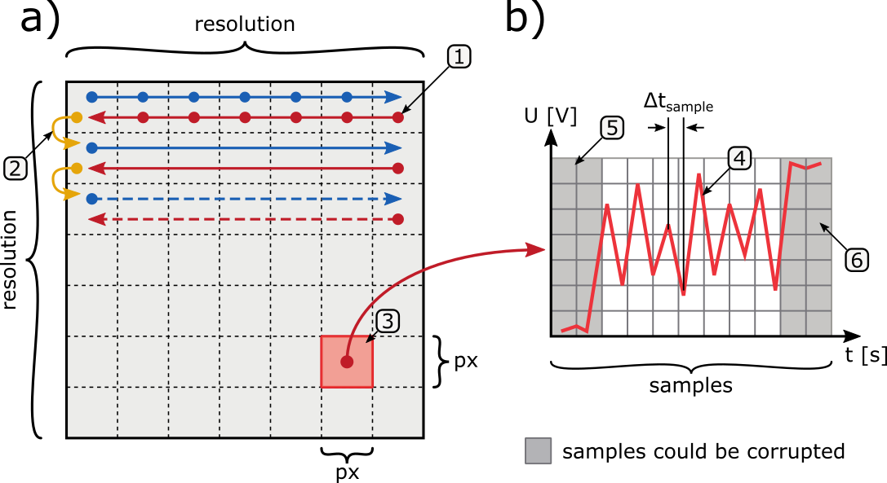

# XY Surface Scanner 

The application is designed to perform surface imaging in the X and Y axes creating a 2D image. This type of application is used in:

* **SPM** -Scanning Probe Microscope,
* **AFM** - Atomic Force Microscope,
* **STM** - Scanning Tunneling Microscope.

For surface imaging, application **XY Surface Scanner** uses an external USB oscilloscope: [Digilent Analog Discovery 2](https://digilent.com/reference/test-and-measurement/analog-discovery-2/start) and package [WaveForms SDK](https://digilent.com/shop/software/digilent-waveforms/). These are the first attempts to create a relatively functional software that can perform a basic surface scan. It will be rebuilt in the future... in near future... I hope. 

## Features
The control is carried out via the terminal console. By executing the basic commands it is possible to control the application. The following basic functionalities are supported:

* Scan `on` / `off`
* Change the scan area
* Scan area offset
* The oscilloscope mode in `idle state`
* Visualization of the new scan line and the previous one in `scan state`  
* Real-time view of: Topography and Error Channels
* Save the result for each channel separately (*.txt and *.png)
  
## Basic concept

The basic concept of the *XY surface scanner* and the basic parameters are shown below. 

*Basic concept a) surface image and b) waveform for a single pixel image*

